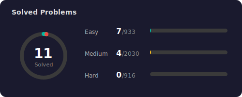

<h1 align="center">Hi 👋, I'm Long (tranduclong-se)</h1>
<h3 align="center">🚀 Backend-focused Software Engineer | Node.js Enthusiast 🚀</h3>

<p align="center">
  <a href="mailto:tranduclong.se@gmail.com">
    
  </a>
  <a href="https://www.linkedin.com/in/tranduclongse-tdmu">
    
  </a>
  <a href="https://www.facebook.com/longtran.530215">
    
  </a>
  <a href="https://t.me/Ryuu_Tran">
    
  </a>
  <a href="https://www.instagram.com/itlong30102003">
    
  </a>
  <a href="https://www.threads.net/@itlong30102003">
    
  </a>
  <a href="https://github.com/tranduclong-se">
    
  </a>
</p>

---

### 👨‍💻 **About Me**
I am a **Backend-focused Software Engineer** with a deep passion for building robust, high-performance server-side applications within the **JavaScript/TypeScript ecosystem**. My expertise lies in designing **RESTful APIs** and **modular architectures** that prioritize clean, maintainable code and system reliability. I take pride in writing **production-ready logic** and have a strong mindset for backend optimization, complemented by a solid understanding of modern deployment workflows, including **Linux environments** and **Docker containerization**.

- 🔭 I’m currently working on **Scalable Backend Services**
- 🌱 I’m currently learning **System Design & Cloud Infrastructure**
- ⚡ Fun fact: I prefer **Terminal** over GUI and **Clean Code** over quick fixes.

---

### 🛠 **Tech Stack**

#### 📜 **Languages**
<p align="left">
  
</p>

#### 🚀 **Frameworks & Libraries**
<p align="left">
  
</p>

#### 🗄️ **Databases & Caching**
<p align="left">
  
</p>

#### ☁️ **Cloud & DevOps**
<p align="left">
  
</p>

#### 🛠️ **Development Tools & Integrations**
<p align="left">
  
</p>

#### 🤖 **AI & Data Processing**
<p align="left">
  
  
  
  
  
</p>

---

### 📊 **this week i spent my time on:**
<!--START_SECTION:waka-->

```txt
Java              1 hr 12 mins          ██████████▒░░░░░░░░░░░░░░   41.22 %
Markdown          44 mins               ██████▒░░░░░░░░░░░░░░░░░░   25.30 %
XML               23 mins               ███▒░░░░░░░░░░░░░░░░░░░░░   13.02 %
JavaScript        16 mins               ██▒░░░░░░░░░░░░░░░░░░░░░░   09.17 %
JSON              10 mins               █▒░░░░░░░░░░░░░░░░░░░░░░░   05.98 %
```

<!--END_SECTION:waka-->

---

### 📊 **GitHub Stats**
<p align="center">
  
</p>

<p align="center">
  
  
</p>

<p align="center">
  
  
</p>

---

### 🧩 **LeetCode Stats**
<!--START_SECTION:leetcode-->
<p align="center">
  
</p>
<!--END_SECTION:leetcode-->

### 🐍 **Snake Eating My Contributions**


### Language Skills
- **Vietnamese**: Native
- **English**: Reading Documentation
- **Japanese (JLPT N5)**: 
  `█████░░░░░░░░░░░░░░░` 25% (Targeting N3 in 2026)

<br>
<h4 align="center">Thanks for visiting! Feel free to star some repositories if you find them interesting! </h4>
